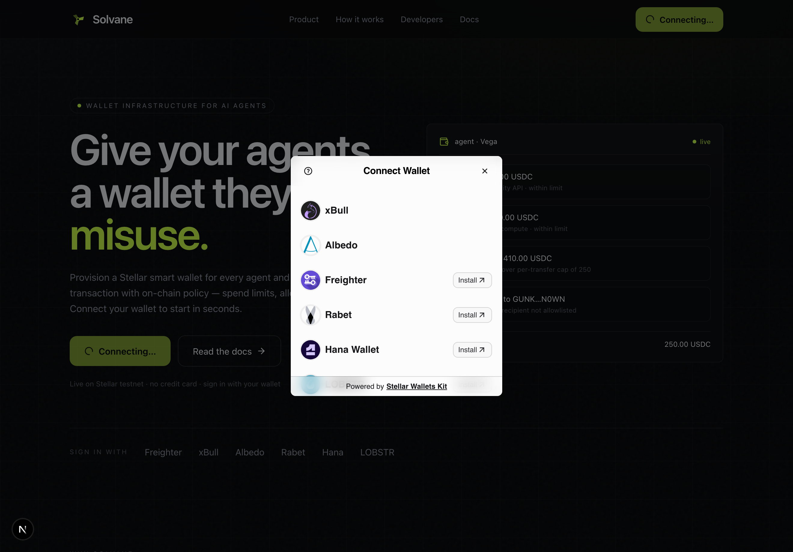

# Solvane

Wallet infrastructure for AI agents on Stellar — create a wallet for an agent and
govern everything it does with on-chain policy. Think Crossmint, built on
Stellar/Soroban.

## Demo & on-chain proof

| | |
|---|---|
| **Network** | Stellar Testnet |
| **Deployed contract** | [`CBLLJCP2…R4DB`](https://stellar.expert/explorer/testnet/contract/CBLLJCP2N2TB4LJYEUGTN3NHPF7T5HZITFOBCGYEUDYFZYU4JDDVR4DB) |
| **Contract-call tx** — `set_limit` | [`708aad6b…21cc`](https://stellar.expert/explorer/testnet/tx/708aad6b981ca0792651d06a4a4ae0b3ac6ffe22a23c285f5acc74969a4921cc) |
| **Policy-enforced transfer** | [`b6f3132e…e48c`](https://stellar.expert/explorer/testnet/tx/b6f3132e6e78b1882fc1b18cc1005f7adbcb86af04585805eb2978e7c440e48c) |
| **Live demo** | _deploy to Vercel/Netlify and paste the URL here_ |

**Sign in with** (multi-wallet, via [Stellar Wallets Kit](https://stellarwalletskit.dev)):
Freighter · xBull · Albedo · Rabet · Hana · LOBSTR



## Setup

Prerequisites: Rust + `wasm32v1-none` target, the [Stellar CLI](https://developers.stellar.org/docs/tools/cli), and Node 20+.

```bash
# 1. Build the smart-wallet contract → wasm
stellar contract build

# 2. Service: install deps, generate + fund a relayer, deploy a wallet
cd service && npm install && npm run keys && npm run deploy
#   then prove the policy path end-to-end on testnet:
npm run -s tsx src/scripts/set-limit.ts     # signed set_limit through __check_auth
npx tsx src/scripts/demo-transfer.ts         # approved + policy-blocked transfer

# 3. Console (Next.js)
cd ../web && npm install && npm run dev       # http://localhost:3000
npm test                                      # vitest
```

Secrets (`service/.env`, `web/.env.local`) are git-ignored. The console reads
on-chain state with no secret; only deploy/write use the relayer key.

## Why Stellar

- **Soroban custom accounts** (`__check_auth`) put spend limits, allowlists and
  signer rules *in the authorization path*. A leaked agent session key still
  can't exceed its policy.
- **Relayer-paid fees** — agent wallets hold zero XLM; a relayer account pays
  gas. Native "gasless" UX (extendable to Launchtube).
- **Native USDC** for stable-value agent payments.

## Custody model

Smart wallet + policy signers. Each agent gets a Soroban smart-account contract.
The platform/agent holds an ed25519 signer; on-chain policy bounds spending.
`Admin` signers manage config; `Spender` signers can only move funds, within policy.

## Layout

```
contracts/smart-wallet/   Soroban contract (Rust): signers, policy, __check_auth
service/                  TypeScript service + scripts (deploy, keys, set-limit, transfer)
web/                      Solvane console (Next.js 16, React 19, Tailwind v4)
.github/workflows/ci.yml  CI: contract test+build wasm, frontend test+build
```

## Two wallet roles

- **Operator wallet (Freighter)** — the *human* who signs up, funds the platform,
  and provisions agents. Connect/disconnect, XLM balance, and Freighter-signed
  XLM payments live in the console topbar.
- **Agent wallets (Soroban smart accounts)** — the autonomous agents' wallets,
  governed by on-chain policy. Created and funded by the operator; never a browser
  wallet.

## Smart-wallet contract

- `__constructor(owner)` — registers the owner as an Admin signer.
- Admin ops (auth via `__check_auth`): `add_signer`, `remove_signer`, `set_limit`,
  `set_allowlist_enforced`, `set_recipient`.
- Views: `signer_role`, `limit`, `allowlist_enforced`.
- `__check_auth` — verifies an ed25519 signature from a registered signer, then
  enforces policy over the authorized contexts (per-token transfer cap +
  optional recipient allowlist). Admin-only for any non-transfer call.

## Status

**Verified on testnet:**
- ✅ Contract compiles + unit tests pass; ~6.6 KB optimized wasm.
- ✅ Deploy to testnet (relayer pays fees), instantiate with constructor.
- ✅ On-chain read confirms owner registered as `Admin`.
- ✅ **Write path** — `set_limit` signed by the agent key passes `__check_auth`
  and updates on-chain state (`service/src/scripts/set-limit.ts`).
- ✅ **Policy-enforced transfers** — 100 XLM transfer APPROVED, 400 XLM transfer
  BLOCKED on-chain (LimitExceeded) by `__check_auth`
  (`service/src/scripts/demo-transfer.ts`).
  - Live instance: `CBLLJCP2N2TB4LJYEUGTN3NHPF7T5HZITFOBCGYEUDYFZYU4JDDVR4DB`

The signing flow uses the SDK's `authorizeEntry` (the contract's `SignerSig`
fields are `{ public_key, signature }` to match), with a **two-pass simulation**
so `__check_auth`'s storage reads land in the transaction footprint.

## Quickstart

```bash
# 1. build the contract
stellar contract build

# 2. service deps + keys (funds a relayer on testnet)
cd service && npm install && npm run keys

# 3. deploy a wallet for the agent
npm run deploy            # writes WALLET_ADDRESS to service/.env
```

## Console (web/)

Live integration with testnet, not a mockup:
- **Freighter sign-in** — connect/disconnect, live XLM balance, Freighter-signed
  `Send XLM` with success/failure + tx hash, and 4 distinct typed error states
  (not-installed, rejected, wrong-network, insufficient/invalid).
- **Live on-chain reads** — a deployed agent wallet's detail page shows its real
  signer role, allowlist flag, balance and per-transfer limit (Soroban simulation).
- **Write from the console** — "set limit" submits a real signed `set_limit` tx.
- **Real-time events** — streams the wallet's native-asset `transfer` events via
  Soroban `getEvents` (polled), plus a live RPC-latency indicator.

```bash
cd web && npm install && npm run dev      # http://localhost:3000
npm test                                  # vitest
```

## Levels

- **L1 — Freighter + payments:** ✅ connect/disconnect, testnet, balance, send XLM
  with feedback + hash.
- **L2 — contract from frontend:** ✅ deployed contract, called from the console
  (reads + `set_limit` write), visible tx status, 3+ error types, real commits.
- **L3 — production practices:** ✅ advanced contract (custom account + policy),
  inter-contract calls (wallet → token SAC), event streaming, CI/CD, mobile-
  responsive nav, error/loading states, contract + frontend tests, docs.

## Roadmap (next)

1. Validate the signed transfer end-to-end; add a deny-path demo (over-limit /
   non-allowlisted recipient rejected on-chain).
2. **Rolling time-window limits** (daily caps) instead of per-transfer caps.
3. **Sequence/concurrency** — channel accounts so an agent can fire many txs.
4. **Service API** — REST + SDK (`createWallet`, `send`, `setPolicy`), scoped
   per-agent API keys, idempotency keys, webhooks/audit log.
5. **Kill-switch & signer rotation**; session-key issuance with expiry.
6. **Launchtube** integration for fee sponsorship at scale.
7. Mainnet hardening: contract audit, key management (KMS/HSM), observability.
